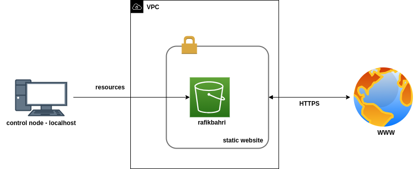

S3 static website deployment
============================

Given an AWS access keys and a local path to a static website resources, this project deploys the website to S3.

Architecture
------------

Requirements
------------

| Tool         | Minimum version |
|--------------|-----------------|
| ansible      | 2.10.8          |
| ansible-lint | 5.4.0           |

Configuration
-------------

| Variable                  | Description                            |
|---------------------------|----------------------------------------|
| bucket_local_website_path | Local path to static website resources |
| bucket_name               | Desired (or existent) S3 bucket name   |
| tags                      | Tags if any                            |

TODO
----

- Solve ansible-playbook warnings
